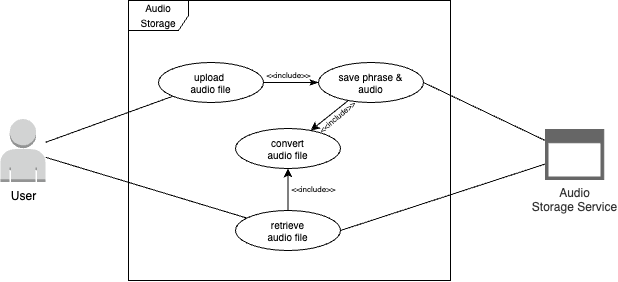
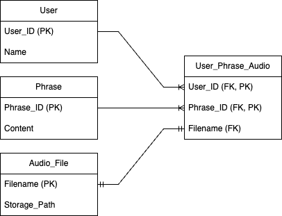
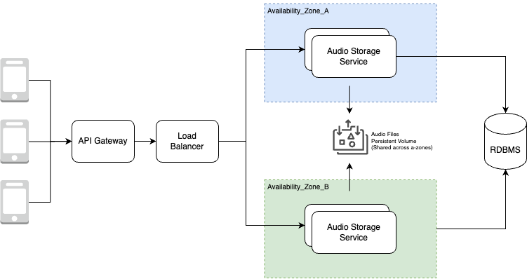

<!-- TOC -->

# Audio Storage Service

## Overview

Audio Storage Service is a RESTful web service that allows users to upload and download audio files.

### Prerequisites
- Java 17
- Running Docker
- Internet Connection
- FFmpeg
  - For Mac: `brew install ffmpeg`
  - For Ubuntu: `sudo apt-get install ffmpeg`
  - For Windows: [Download FFmpeg](https://ffmpeg.org/download.html)

### Running the Application

1. Open a terminal and navigate to the project root directory.
2. Run the following command to start the application:
   ```bash
   ./gradlew clean bootRun
   ```
   >**NOTE**: Running the command above will automatically start a MySQL server from 
   > `src/main/docker/compose.yml` before the application starts and stop it when the application 
   > shuts down.

### Using the Application

#### Test Data

| User ID | Phrase ID |
|---------|-----------|
| 1       | 1         |
| 1       | 2         |
| 2       | 1         |
| 2       | 2         |

#### Upload an audio file:
```bash
 curl --request POST 'http://localhost/audio/user/<USER_ID>/phrase/<PHRASE_ID>' --form 'audio_file=@"./test_audio_file_1.m4a"'
```

#### Get an audio file:
```bash
 curl --request GET 'http://localhost/audio/user/<USER_ID>/phrase/<PHRASE_ID>/m4a' -o './test_audio_file_1.m4a'
```

## Design

### Use Case


### Data Model


### Deployment Landscape
